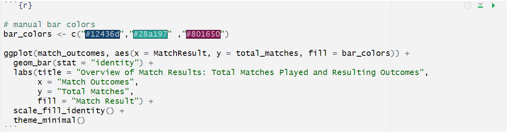
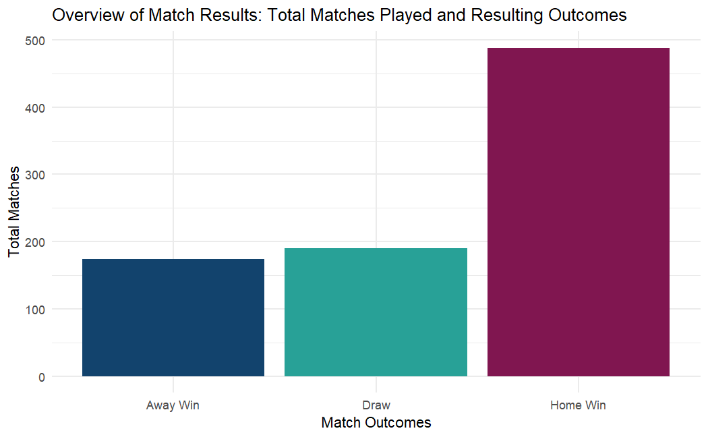
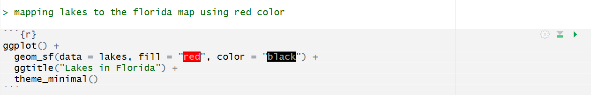
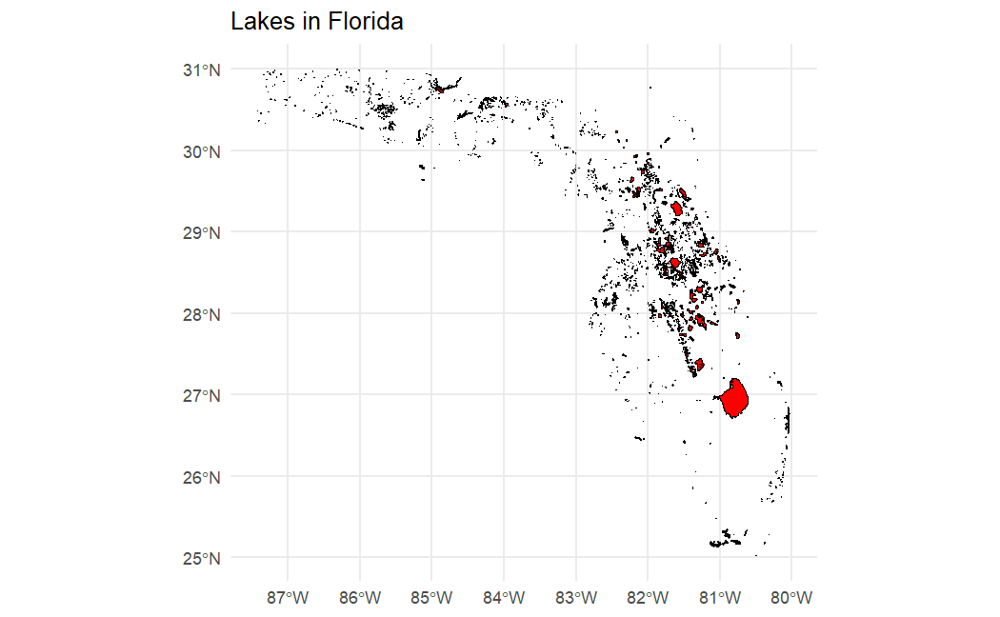
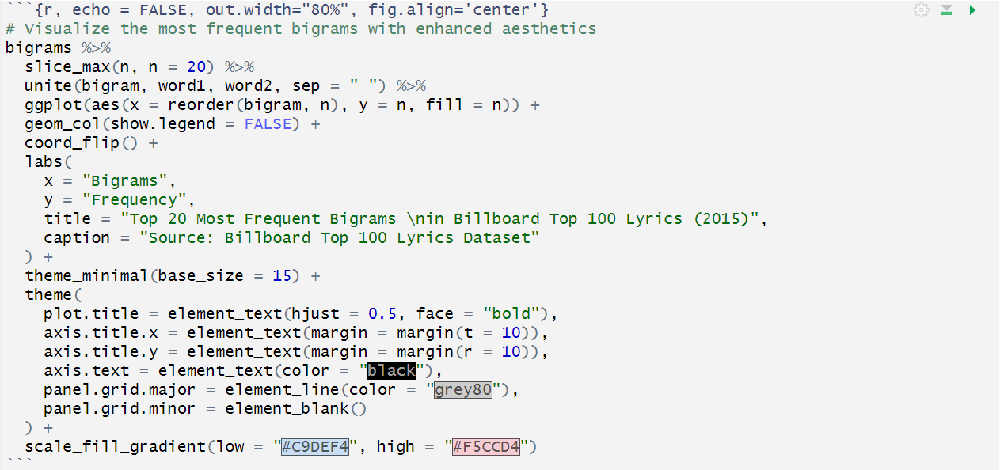
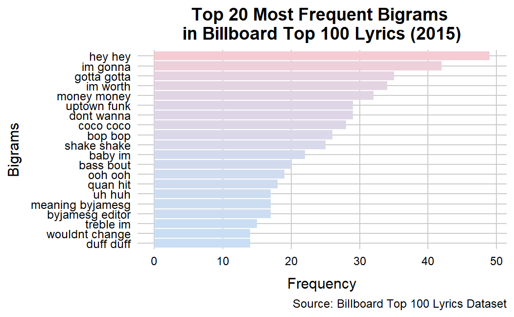

# Data Visualization and Reproducible Research

> Divyesh Desai - `ddesai7656@floridapoly.edu` 

Learn more about me in my [GitHub profile page](https://github.com/divyesh565). 

The following is a sample of products created during the _"Data Visualization and Reproducible Research"_ course.

## Project 01

In the `project_01/` folder, you will find three distinct visualizations based on World Cup Matches data. I analyzed this data and generated several visualizations. Below is my favorite, which provides a comprehensive overview of match results along with their total counts.

#### **Code** 

***

## Project 02

In the `project_02/` folder, you will discover three unique visualizations created from different data sets. Among these, my favorite is a chart that highlights the locations of lakes on a map of Florida.  

#### **Code** 

## Project 03

In this project `project_03/`, In addition to the various visualizations that were requested, I also delved into the Billboard Top 100 Lyrics data from 2015. I conducted a detailed text analysis on the lyrics and created a visualization chart showcasing the top 20 most frequently used words.  

#### **Code**

### Moving Forward

This course has been immensely valuable in expanding my understanding of data visualization. I've learned not only the technical aspects of creating effective visualizations but also the best practices that should be followed to ensure clarity and impact. One of the most significant insights I gained is the importance of aesthetic details in various types of visualizations. By thoughtfully applying color, design principles, and innovative techniques, I can create visualizations that are not only informative but also engaging and visually appealing. This comprehensive approach to data visualization will enable me to present data in a way that tells compelling stories and drives insightful decision-making in any professional context.